# 🎓 Journey: Lightweight Speech Enhancement Using Shallow Transformers
_A complete chronicle — from initial proposal to running experiments — by Krishnasinh Jadeja (22BLC1211), Kirtan Sondagar (22BLC1228), Prabhu Kalyan Panda (22BLC1213)_  
_Guide: Dr. Praveen Jaraut | VIT Bhopal Capstone 2025-26_

---

## Table of Contents

1. [The Problem We Set Out to Solve](#1-the-problem-we-set-out-to-solve)
2. [Initial Plan (Project2.pdf)](#2-initial-plan-project2pdf)
3. [The Agent-Driven Workflow](#3-the-agent-driven-workflow)
4. [Project Timeline Overview](#4-project-timeline-overview)
5. [Review 1 — CRN Baseline](#5-review-1--crn-baseline-jan-21-2026)
6. [Review 2 — CNN Transformer (Mel) — The Failure](#6-review-2--cnn-transformer-mel--the-failure-feb-18-2026)
7. [Review 3 — STFT Transformer — The Fix](#7-review-3--stft-transformer--the-fix-mar-18-2026)
8. [Architecture Evolution Summary](#8-architecture-evolution-summary)
9. [Debugging & Iteration Log](#9-debugging--iteration-log)
10. [Metrics Comparison](#10-metrics-comparison-all-reviews)
11. [Key Learnings](#11-key-learnings)
12. [Whats Next — Review 4 & Final](#12-whats-next--review-4--final)

---

## 1. The Problem We Set Out to Solve

**Core challenge:** Real-time speech enhancement in noisy environments for resource-constrained platforms (hearing aids, mobile, embedded).

| Existing Approach | PESQ | Latency | Why It Fails |
|---|---|---|---|
| DSP / Wiener Filter | 2.1–2.5 | 1–2ms | Poor at low SNR |
| CNN / U-Net | 2.6–2.8 | 4–8ms | No long-range context |
| CRN (RNN-based) | 3.1 | 6.4ms | Sequential, slow training |
| Full Transformer | 3.4 | 45ms | 100GB data, heavy compute |

**Our gap to fill:**

```
PESQ 3.2+ | Latency <15ms | 6–8h training | 6.6GB data | Runs on Kaggle free GPU
```

> **The Research Hypothesis:** A hybrid CNN-Transformer with only 2 layers and 4 attention heads can match CRN quality with better long-range context modeling — keeping it lightweight enough for real deployment.

---

## 2. Initial Plan (Project2.pdf)

The original proposal outlined a 4-phase capstone project with a specific hybrid architecture:

### Proposed Architecture (from PDF)

```mermaid
flowchart LR
    A([Raw Audio\n16kHz WAV]) --> B[STFT\nn_fft=512\nhop=256]
    B --> C[Log-Mel\n128 bins × T]
    C --> D[CNN Encoder\n64→128→256\n3×3 Conv, BN, ReLU]
    D --> E[Transformer\n2 layers, 4 heads\nd_model=256]
    E --> F[CNN Decoder\n256→128→64→1\nSigmoid Mask]
    F --> G{Mask × Noisy}
    G --> H[iSTFT\nEnhanced Audio]

    style A fill:#1a1a2e,color:#eee,stroke:#4a90d9
    style H fill:#0f3d0f,color:#eee,stroke:#4caf50
    style E fill:#2d1b69,color:#eee,stroke:#9c27b0
    style F fill:#2d1b69,color:#eee,stroke:#9c27b0
```

### Target Parameters (Initial Proposal)

| Target | Value | Rationale |
|---|---|---|
| Params | ~350K | 85% fewer than CRN (2.1M) |
| PESQ | ≥3.2 | Beat CRN baseline |
| Latency | <15ms | Practical for hearing aids |
| Training | 6–8h | Fits Kaggle T4 free tier |

> **Note:** The actual implementation ended up at **2.45M params** (the architecture converged to this during R2 implementation; the 350K target was over-optimistic).

### Planned Project Scope (from PDF)

**Will Cover:**
- Single-channel noise cancellation (SNR 5–20dB)
- Lightweight Transformer (2L, 4H, 350K params)
- PESQ/STOI/SI-SDR + subjective evaluation
- CRN vs Transformer comparison
- Gradio deployment + quantization
- Ablation study (2L vs 4L vs 8L transformers)

**Won't Cover:**
- Multi-speaker separation
- Real-time streaming (batch processing only)
- Audio-visual multi-modal
- Cross-lingual robustness
- Embedded hardware deployment
- Formal MOS with human subjects

---

## 3. The Agent-Driven Workflow

This entire project was executed using an **autonomous AI agent** that controls Kaggle GPU notebooks via MCP (Model Context Protocol).

### System Architecture


### Memory System (Dual-Layer)

```mermaid
graph LR
    subgraph LongTerm ["🧠 Long-Term Memory (memory.md)"]
        A1[Architecture specs]
        A2[Dataset info & paths]
        A3[Kaggle notebook slugs/IDs]
        A4[Known bugs & workarounds]
        A5[Training configs]
        A6[Eval results all phases]
    end

    subgraph ShortTerm ["📋 Short-Term Memory (learningsandprogress.md)"]
        B1[Session log with dates]
        B2[What was done ✅]
        B3[What failed ⚠️]
        B4[Immediate next steps]
        B5[Debug notes]
    end

    subgraph OpManual ["📖 Agent.md — Operating Manual"]
        C1[Who the agent is]
        C2[Available tools list]
        C3[Kaggle notebook workflow]
        C4[Critical never-lose info]
    end

    Agent([🤖 Agent]) --> LongTerm
    Agent --> ShortTerm
    Agent --> OpManual

    style LongTerm fill:#1a1a2e,stroke:#4a90d9,color:#eee
    style ShortTerm fill:#2d1b0e,stroke:#ff9800,color:#eee
    style OpManual fill:#0d2d11,stroke:#4caf50,color:#eee
```

---

## 4. Project Timeline Overview


---

## 5. Review 1 — CRN Baseline (Jan 21, 2026)

### Goal
Establish a CRN (Convolutional Recurrent Network) baseline that the later Transformer must beat.

### Architecture: CRN (Convolutional Recurrent Network)


### Key Technical Details

| Config | Value |
|---|---|
| Dataset | LibriSpeech Noise (6.6GB, 7000 train / 105 test WAV pairs) |
| Preprocessing | STFT (n_fft=512, hop=256) → Log-Mel (128 bins) |
| Batch size | 32 |
| Optimizer | Adam, lr=1e-3 |
| Loss | L1 on Log-Mel spectrograms |
| Hardware | Kaggle T4 GPU (15GB VRAM) |

### Results

```
CRN PESQ: ~3.10  ← estimated (no waveform reconstruction)
```

> **Important caveat:** The R1 PESQ score was **estimated** — no actual waveform reconstruction happened. The model output was evaluated directly on mel spectrograms. This is why it looked better than R2 which did real waveform synthesis.

### Key Bug Fixed in R1

```python
# ❌ WRONG: Input was 256×128 = 32768 — too large for LSTM
lstm_input = cnn_features  # shape: (B, 256, 128, T)

# ✅ FIX: Mean-pool frequency dimension first
lstm_input = cnn_features.mean(dim=2)  # shape: (B, T, 256)
```

---

## 6. Review 2 — CNN Transformer (Mel) — The Failure (Feb 18, 2026)

### Goal
Replace LSTM with a Shallow Transformer (2L, 4H) — keep CNN backbone, target PESQ ≥3.2.

### Architecture: ShallowTransformerEnhancer

```mermaid
flowchart TD
    A([Raw Audio\n16kHz]) --> B[MelSpectrogram\n128 mels, n_fft=512, hop=256]
    B --> |"log1p → (B,1,128,T)"| C

    subgraph MODEL ["🤖 ShallowTransformerEnhancer — 2.45M params"]
        C[CNN Encoder\nConv2d: 1→64→128→256\n3×3, BatchNorm, ReLU]
        C --> D["mean(freq dim)\n(B, 256, 128, T) → (B, T, 256)"]
        D --> E[Linear pre_proj\n256→256]
        E --> F[PositionalEncoding\nSinusoidal, d=256]
        F --> G[TransformerEncoder\n2 layers × 4 heads\nd_model=256, ff=1024\nPre-LN, dropout=0.1]
        G --> H[Linear post_proj\n256→256]
        H --> |"expand+reshape → (B, 256, 128, T)"| I
        I[CNN Decoder\n256→128→64→1\nConvBlock + Sigmoid]
    end

    I --> J{mask × noisy_mel\n(B, 128, T)}

    subgraph RECON ["🔴 Broken Reconstruction Pipeline"]
        J --> K["expm1(mel)"]
        K --> L["InverseMelScale\ndriver='gelsd'\n⚠️ pseudo-inverse, lossy!"]
        L --> M["GriffinLim\nn_iter=32\n⚠️ phase recovery fails!"]
    end

    M --> N([WAV Output\n⚠️ Full of artifacts])

    style MODEL fill:#1a1a2e,stroke:#4a90d9,color:#fff
    style RECON fill:#3d0000,stroke:#f44336,color:#ffa0a0
    style N fill:#3d0000,color:#ffa0a0,stroke:#f44336
```

### Training Results (25 Epochs, P100 GPU)


| Epoch | Train Loss | Val Loss | LR |
|---|---|---|---|
| 1 | — | 0.1764 | 1e-3 |
| 25 | — | **0.1485** | 1e-3 |
| Δ | — | **16% improvement** | — |

> The model **was learning** — 16% loss reduction. The training pipeline was correct. The failure was entirely in **evaluation reconstruction**.

### Why It Failed: The Mel Non-Invertibility Problem

```mermaid
flowchart LR
    A[Clean Speech\nWaveform] --> B[MelFilterbank\n128 × 257 matrix\n128 = mel bins\n257 = STFT bins]
    B --> C[Mel Spectrogram\n128 bins\nINFORMATION LOST\n257→128 mapping is\nnot invertible!]
    C --> D["InverseMelScale\nLeast-squares pseudo-inverse\ndriver='gelsd'\nReconstructs ~257 bins\nwith approximation errors"]
    D --> E["GriffinLim (32 iters)\nPhase recovery from\nmagnitude only\nIterative STFT/ISTFT\nConverges slowly"]
    E --> F[Reconstructed WAV\n⚠️ High-frequency artifacts\n⚠️ Phase smearing\n⚠️ SI-SDR: -25.58 dB]

    style C fill:#3d0000,color:#ffa0a0,stroke:#f44336
    style F fill:#3d0000,color:#ffa0a0,stroke:#f44336
    style A fill:#0f3d0f,color:#eee,stroke:#4caf50
```

### R2 Evaluation Metrics

| Metric | Noisy Input | Enhanced (R2) | CRN Baseline (R1) | Target |
|---|---|---|---|---|
| **PESQ** | 1.144 | **1.141** 🔴 | ~3.10 (estimated) | ≥3.2 |
| **STOI** | 0.693 | **0.695** 🟡 | — | — |
| **SI-SDR** | -0.82 dB | **-25.58 dB** 🔴 | — | — |

> **STOI improved slightly** — confirming the model learned some speech intelligibility patterns. But phase artifacts from GriffinLim destroyed PESQ and SI-SDR.

### Why CRN Worked (R1) But Transformer Didn't (R2)

```mermaid
flowchart LR
    subgraph CRN ["✅ CRN Pipeline (R1)"]
        A1[STFT] --> B1[Complex: Real + Imag]
        B1 --> C1[Mask applied to\ncomplex STFT]
        C1 --> D1["torch.istft\n← PERFECT reconstruction\nPhase preserved!"]
    end

    subgraph TRANS ["❌ Transformer Pipeline (R2)"]
        A2[MelSpectrogram] --> B2["Many-to-one mapping\n257 STFT bins → 128 Mel bins"]
        B2 --> C2["Pseudo-inverse\n(lossy approximation)"]
        C2 --> D2["GriffinLim (32 iter)\n← Phase guessing\nArtifacts!"]
    end

    style CRN fill:#0f3d0f,stroke:#4caf50,color:#eee
    style TRANS fill:#3d0000,stroke:#f44336,color:#ffa0a0
```

### Debug Journey: Getting R2 to Run on Kaggle (5 Versions)

```mermaid
flowchart TD
    Start[Local Development\nAll local cells ✅\n25 cells, 14 code + 11 MD] --> V1

    V1["v1: Upload to Kaggle\ndatasetDataSources\nmounting via ID"] -->|"❌ Dataset not mounted\nWorks only for new notebooks\nnot ID updates"| V2

    V2["v2: Switch to CLI download\nkaggle datasets download\nwith --internet-enabled"] -->|"❌ 7z extracts to\nnested subdirs\npaths wrong"| V3

    V3["v3: Add find_wav_dir()\nauto-detects actual\nWAV directory path"] -->|"❌ num_workers=2\nDataLoader bug:\n^^ AssertionError spam\nbetween epochs"| V4

    V4["v4: num_workers=0\nfix DataLoader cleanup\nbug on kaggle"] -->|"❌ Same ^^ issue\nnot fixed yet"| V5

    V5["v5: Verified fix:\nnum_workers=0\nPATH confirmed"] -->|"✅ RUNS TO\nCOMPLETION\n25 epochs!"| Done["Training Complete\n25 epochs, P100\nbest_val=0.1485"]

    style Start fill:#1a1a2e,color:#eee,stroke:#4a90d9
    style Done fill:#0f3d0f,color:#eee,stroke:#4caf50
    style V1 fill:#3d1500,color:#ffa0a0,stroke:#f44336
    style V2 fill:#3d1500,color:#ffa0a0,stroke:#f44336
    style V3 fill:#3d1500,color:#ffa0a0,stroke:#f44336
    style V4 fill:#3d1500,color:#ffa0a0,stroke:#f44336
    style V5 fill:#0f3d0f,color:#eee,stroke:#4caf50
```

---

## 7. Review 3 — STFT Transformer — The Fix (Mar 18, 2026)

### Goal
Fix the catastrophically broken reconstruction pipeline by switching from Mel to STFT. Keep the same Transformer architecture.

### The Core Fix

```mermaid
flowchart LR
    subgraph OLD ["❌ Old Pipeline (R2)"]
        direction TB
        O1[STFT] --> O2["MelFilterbank\n257 → 128 bins\nLOSSY!"]
        O2 --> O3[Model]
        O3 --> O4["InverseMelScale\n+ GriffinLim\nARTIFACTS!"]
    end

    subgraph NEW ["✅ New Pipeline (R3)"]
        direction TB
        N1[STFT\nn_fft=512, hop=128] --> N2["|X(t,f)|\n257 bins × T\nFULL RESOLUTION"]
        N2 --> N3[Model]
        N3 --> N4["mask × X_complex\n→ torch.istft\nPERFECT!"]
    end

    style OLD fill:#3d0000,stroke:#f44336,color:#ffa0a0
    style NEW fill:#0f3d0f,stroke:#4caf50,color:#eee
```

### Architecture: STFTTransformerEnhancer (2.45M params)

```mermaid
flowchart TD
    A([Raw Audio\n16kHz WAV\n3s segment\n48000 samples]) --> B

    subgraph PREP ["Signal Preprocessing"]
        B["torch.stft\nn_fft=512, hop=256\nreturn_complex=True"]
        B --> C["noisy_stft\n(B, 257, T)\nComplex tensor"]
        C --> D["log1p(|stft|)\nMagnitude + log\n(B, 1, 257, T)"]
    end

    D --> E

    subgraph MODEL ["🤖 STFTTransformerEnhancer — 2,451,457 params"]
        E[CNN Encoder\nConv2d: 1→64→128→256\n3×3, BatchNorm, ReLU]
        E --> F["mean(dim=2)\n⚠️ BOTTLENECK\n257 freq bins → 1 value per time step\n(B, T, 256)"]
        F --> G[Linear pre_proj\n256→256]
        G --> H[PositionalEncoding\nSinusoidal, dropout=0.1]
        H --> I[TransformerEncoder\n2 layers × 4 heads\nd_model=256, ff=1024\nPre-LN, dropout=0.1]
        I --> J[Linear post_proj\n256→256]
        J --> K["expand → (B, 256, 257, T)\nCNN Decoder\n256→128→64→1 + Sigmoid"]
    end

    K --> |"mask (B, 257, T)"| L

    subgraph RECON ["✅ Lossless Reconstruction"]
        L["enhanced_mag = mask × |X|"]
        L --> M["enhanced_stft = enhanced_mag × exp(j·angle(noisy_stft))"]
        M --> N["torch.istft\nn_fft=512, hop=256\nLOSSLESS!"]
    end

    N --> O([Enhanced WAV\nRoundtrip error: 7.15e-07 ✅])

    style PREP fill:#1a1a2e,stroke:#4a90d9,color:#eee
    style MODEL fill:#2d1b69,stroke:#9c27b0,color:#eee
    style RECON fill:#0f3d0f,stroke:#4caf50,color:#eee
    style F fill:#4a2500,color:#ffb74d,stroke:#ff9800,stroke-width:3px
```

### R3 Training Results (v3, 25 Epochs, P100 GPU)

| Epoch | Val Loss | Notes |
|---|---|---|
| 1 | 0.1072 | Baseline |
| 2 | 0.1065 | Saved |
| 5 | 0.1051 | Saved |
| 11 | 0.1056 | LR → 5e-4 |
| **15** | **0.1050** | **BEST CHECKPOINT saved** |
| 21 | 0.1055 | LR → 2.5e-4 |
| 25 | 0.1065 | Early stop (patience 10) |
| **Δ** | **2% improvement** | ⚠️ vs 16% in R2 |

> Training total: **7291s (~2h)**, 293s/epoch. The model barely improved — a red flag.

### R3 Debug Journey: Getting It Running (4 Versions)

```mermaid
flowchart TD
    Start["R3 Notebook Built Locally\nValidated: STFT roundtrip 7.15e-07\n2.45M params ✅"] --> V1

    V1["v1 pushed to Kaggle"] -->|"❌ PyTorch 2.6\n`total_mem` attr removed\nAttributeError on GPU check"| Fix1

    Fix1["Fix: getattr(props, 'total_memory', props.total_mem)"] --> V2

    V2["v2 pushed\nTraining starts..."] -->|"❌ Python 3.12\n`verbose` kwarg removed\nfrom ReduceLROnPlateau"| Fix2

    Fix2["Fix: remove verbose=False"] --> V3

    V3["v3 runs to completion!\n25 epochs ✅\nbest_val=0.1050\nat epoch 15"] -->|"❌ Eval cell fails\ntorch.load weights_only=True\nblocks numpy scalars in ckpt"| Fix3

    Fix3["Fix: weights_only=False\n+ float(va_loss) in checkpoint"] --> V4

    V4["v4 pushed\n⚠️ SaveAndRunAll retrains\nfrom scratch — overwrites\nv3 best checkpoint!"] -->|"📥 Downloaded v3 ckpt\ndirectly from Kaggle output\n(stft_transformer_best.pth)"| Eval

    Eval["✅ Local CPU Eval\n105 test samples\n~30 mins on CPU\nresults → review3_summary.json"]

    style Start fill:#1a1a2e,color:#eee,stroke:#4a90d9
    style Eval fill:#0f3d0f,color:#eee,stroke:#4caf50
    style V1 fill:#3d1500,color:#ffa0a0,stroke:#f44336
    style V2 fill:#3d1500,color:#ffa0a0,stroke:#f44336
    style V3 fill:#1a4d00,color:#c8e6c9,stroke:#4caf50
    style V4 fill:#3d1500,color:#ffa0a0,stroke:#f44336
```

### R3 Evaluation Results

| Metric | Noisy Input | Enhanced (R3) | Δ | R2 Enhanced |
|---|---|---|---|---|
| **PESQ** | 1.163 | **1.089** 🔴 | -0.074 | 1.141 |
| **STOI** | 0.722 | **0.622** 🔴 | -0.1009 | 0.695 |
| **SI-SDR** | -0.25 dB | **-1.65 dB** 🟡 | -1.40 dB | **-25.58 dB** |

### What R3 Fixed vs R2


> **Key result:** R3 fixed the SI-SDR degradation from -25.58 dB (R2) to -1.65 dB (R3) — a **~24 dB improvement** in reconstruction quality. The STFT pipeline works perfectly. The problem is now confirmed to be the **model architecture itself**, not the pipeline.

### Root Cause: The Frequency Bottleneck

```mermaid
flowchart TD
    subgraph Problem ["⚠️ Why The Model Can't Learn"]
        B["Input: (B, 1, 257, T)\n257 frequency bins\nFull spectral resolution"] --> C
        C["CNN Encoder output:\n(B, 256, 257, T)\nStill 257 freq bins"] --> D
        D["mean(dim=2) ← THE BOTTLENECK\n257 bins collapsed to 1 value!\n(B, T, 256)\nAll frequency information LOST!"]
        D --> E["Transformer only sees:\n'How does this time step\ncorrelate with others?'\nCAN'T model:\n'Which frequencies are noise?'"]
        E --> F["Decoder must reconstruct\nfrequency-specific mask\nfrom frequency-uniform features\n← Impossible!"]
        F --> G["Model defaults to:\nnear-identity mask\n≈ 0.5 everywhere\nMinimizes L1 loss by\ndoing almost nothing"]
    end

    style D fill:#4a2500,color:#ffb74d,stroke:#ff9800,stroke-width:3px
    style G fill:#3d0000,color:#ffa0a0,stroke:#f44336
```

**The Fix Needed for R4:**

```python
# ❌ Current: Collapses 257 freq bins to 1
x = x.mean(dim=2)  # (B, T, 256)

# ✅ Option A: Reshape freq into embedding dim
# (B, 256, 257, T) → (B*257, T, 256) → Transformer → reshape back

# ✅ Option B: 2D Transformer (FreqFormer)
# Model both time AND frequency dependencies

# ✅ Option C: Go back to CRN-style
# Keep STFT pipeline but use LSTM (which worked at R1)
```

---

## 8. Architecture Evolution Summary

```mermaid
flowchart LR
    subgraph R1 ["Review 1\nCRN Baseline"]
        direction TB
        R1A[Log-Mel\n128 bins]
        R1B[CNN Encoder]
        R1C[LSTM\nTemporal]
        R1D[CNN Decoder]
        R1E[Mel Mask]
        R1A --> R1B --> R1C --> R1D --> R1E
        R1F["PESQ: ~3.10\n(estimated)\nNo real reconstruction"]
    end

    subgraph R2 ["Review 2\nTransformer-Mel ❌"]
        direction TB
        R2A[Log-Mel\n128 bins]
        R2B[CNN Encoder]
        R2C["mean(freq)\n→ Transformer\n2L, 4H, d=256"]
        R2D[CNN Decoder]
        R2E[Mel Mask]
        R2F["InverseMelScale\n+ GriffinLim\n← BROKEN!"]
        R2A --> R2B --> R2C --> R2D --> R2E --> R2F
        R2G["PESQ: 1.141 🔴\nSI-SDR: -25.58dB"]
    end

    subgraph R3 ["Review 3\nTransformer-STFT 🟡"]
        direction TB
        R3A[STFT Mag\n257 bins]
        R3B[CNN Encoder]
        R3C["mean(freq)\n→ Transformer\n← BOTTLENECK!"]
        R3D[CNN Decoder]
        R3E[STFT Mask]
        R3F["× complex STFT\n→ torch.istft\n← LOSSLESS ✅"]
        R3A --> R3B --> R3C --> R3D --> R3E --> R3F
        R3G["PESQ: 1.089 🔴\nSI-SDR: -1.65dB 🟡"]
    end

    subgraph R4 ["Review 4 (Planned)\nFreqTransformer 🎯"]
        direction TB
        R4A[STFT Mag\n257 bins]
        R4B[CNN Encoder]
        R4C["Keep freq dim!\nFreqFormer\nor CRN+STFT"]
        R4D[CNN Decoder]
        R4E[STFT Mask]
        R4F["× complex STFT\n→ torch.istft\n← LOSSLESS ✅"]
        R4A --> R4B --> R4C --> R4D --> R4E --> R4F
        R4G["Target PESQ: ≥3.2 🎯"]
    end

    R1 -.->|"Replace LSTM\nwith Transformer"| R2
    R2 -.->|"Fix reconstruction\npipeline"| R3
    R3 -.->|"Fix architecture\nbottleneck"| R4

    style R1 fill:#1a1a2e,stroke:#4a90d9,color:#eee
    style R2 fill:#3d1500,stroke:#f44336,color:#ffa0a0
    style R3 fill:#2d2000,stroke:#ff9800,color:#ffcc80
    style R4 fill:#0f3d0f,stroke:#4caf50,color:#c8e6c9
```

---

## 9. Debugging & Iteration Log

### Complete Bug Registry

```mermaid
mindmap
  root((Bugs Fixed\nAcross All Reviews))
    R1 - CRN Baseline
      LSTM input shape wrong
        Was 256×128=32768
        Fix: mean pool freq dim first → 256
    R2 - Transformer Mel
      Dataset mounting broken
        datasetDataSources + ID update = no-op
        Fix: kaggle datasets download CLI
      7z nested paths
        Extracts to wrong subdir
        Fix: find_wav_dir helper
      DataLoader ^^ spam
        num_workers=2 + fork = AssertionError
        Fix: num_workers=0
    R3 - STFT Transformer
      PyTorch 2.6 attr change
        total_mem → total_memory
        Fix: getattr with fallback
      Python 3.12 ReduceLROnPlateau
        verbose kwarg removed
        Fix: remove verbose=False
      torch.load safety
        weights_only=True blocks numpy
        Fix: weights_only=False
      SaveAndRunAll wipes outputs
        v4 overwrote v3 checkpoint
        Fix: download manually first
```

### Time Spent Per Phase


---

## 10. Metrics Comparison (All Reviews)

### PESQ Scores


### SI-SDR Scores


### Full Comparison Table

| Review | Architecture | Pipeline | PESQ | STOI | SI-SDR | Params | Status |
|---|---|---|---|---|---|---|---|
| **R1 CRN** | Conv + LSTM | Mel (estimated only) | ~3.10 ✅ | — | — | ~2.5M | Estimated only |
| **R2 Transformer-Mel** | CNN + Transformer | Mel → InverseMel → GriffinLim | 1.141 🔴 | 0.695 | -25.58 dB 🔴 | 2.45M | Model learned, pipeline broken |
| **R3 Transformer-STFT** | CNN + Transformer | STFT → ISTFT (lossless) | 1.089 🔴 | 0.622 | -1.65 dB 🟡 | 2.45M | Pipeline fixed, model bottleneck |
| Noisy baseline | — | — | 1.163 | 0.722 | -0.25 dB | — | Reference |

---

## 11. Key Learnings

### Technical

```mermaid
flowchart TD
    L1["📌 Learning 1\nMel spectrograms are\nnon-invertible.\nNever use GriffinLim for evaluation.\nAlways STFT → ISTFT."]
    L2["📌 Learning 2\nmean(freq dim) before\nTransformer is a fatal bottleneck.\nTransformer needs\nfrequency context to learn\nwhich bins are noise."]
    L3["📌 Learning 3\nModel training loss ≠ output quality.\nL1 loss can decrease while\noutput degrades.\nUse SI-SDR as secondary check."]
    L4["📌 Learning 4\nKaggle datasetDataSources\nnot reliable for notebook updates.\nUse CLI download instead."]
    L5["📌 Learning 5\nnum_workers > 0 causes ^^\nassertionErrors on Kaggle.\nAlways use num_workers=0."]
    L6["📌 Learning 6\nPyTorch 2.6 + Python 3.12\nbreak several deprecated APIs.\ntest compat before Kaggle push."]
    L7["📌 Learning 7\nSaveAndRunAll wipes outputs.\nDownload checkpoints BEFORE\npushing a new version!"]

    style L1 fill:#1a1a2e,color:#90caf9,stroke:#4a90d9
    style L2 fill:#2d1b69,color:#ce93d8,stroke:#9c27b0
    style L3 fill:#1a4731,color:#a5d6a7,stroke:#4caf50
    style L4 fill:#1a3a00,color:#c5e1a5,stroke:#8bc34a
    style L5 fill:#4a2500,color:#ffcc80,stroke:#ff9800
    style L6 fill:#3d1500,color:#ffab91,stroke:#f44336
    style L7 fill:#1a0033,color:#e1bee7,stroke:#9c27b0
```

### Research Insights

1. **CRN's secret:** It uses complex STFT → ISTFT which preserves phase perfectly. This is why PESQ=3.1 is achievable even with an LSTM.

2. **Transformer limitation:** Replacing LSTM with Transformer in a frequency-collapsed (mean-pooled) setting gives no benefit — the Transformer never sees which frequencies are noise.

3. **Two separate problems identified and isolated:**
   - R2 had a broken pipeline + potentially working model → we couldn't tell
   - R3 proved the pipeline by computing SI-SDR (-1.65 vs -25.58 dB) — reconstruction is now lossless
   - R3 confirmed the model is the problem by seeing PESQ still degraded

4. **Val loss is not enough:** R2 trained with 16% val loss improvement but PESQ went to 1.141. R3 trained with only 2% loss improvement. Both models converge to near-identity masks.

---

## 12. What's Next — Review 4 & Final

### Planned Architecture: FreqTransformer (Keep Frequency Dimension)

```mermaid
flowchart TD
    A([STFT Magnitude\nB × 257 × T]) --> B

    subgraph FIX ["Frequency-Aware Transformer"]
        B["CNN Encoder\n1→64→128→256\n(B, 256, 257, T)"]
        B --> C["Reshape for Transformer\n(B×T, 257, 256)\nor use 2D attention"]
        C --> D["TransformerEncoder\nNow operates on 257 freq bins!\nEach freq bin attends to others\n← Spectral masking possible!"]
        D --> E["Reshape back\n(B, 256, 257, T)"]
        E --> F["CNN Decoder\n256→128→64→1\nSigmoid mask"]
    end

    F --> G["STFT Mask × Complex STFT\n→ torch.istft\nLossless reconstruction"]

    style FIX fill:#0f3d0f,stroke:#4caf50,color:#eee
```

### Full Timeline to Completion

```mermaid
flowchart LR
    D1["✅ Review 1\nJan 21, 2026\nCRN Baseline\nPESQ ~3.10\n(estimated)"]
    D2["✅ Review 2\nFeb 24, 2026\nTransformer-Mel\nPESQ 1.141\n(pipeline failure identified)"]
    D3["✅ Review 3\nFeb 24, 2026\nSTFT-Transformer\nPESQ 1.089\n(bottleneck identified)"]
    D4["🔄 Review 4\nMar 18, 2026\nFreqTransformer\nTarget PESQ ≥3.2\n(fix freq bottleneck)"]
    D5["⏳ Final\nApr 8, 2026\nQuantized + Gradio\nINT8 4× compression\nEdge deployment"]

    D1 -->|"Replace LSTM\nwith Transformer"| D2
    D2 -->|"Fix reconstruction:\nMel → STFT"| D3
    D3 -->|"Fix bottleneck:\nkeep freq dim"| D4
    D4 -->|"Optimize &\ndeploy"| D5

    style D1 fill:#1a4731,color:#eee,stroke:#4caf50
    style D2 fill:#3d1500,color:#ffa0a0,stroke:#f44336
    style D3 fill:#2d2000,color:#ffcc80,stroke:#ff9800
    style D4 fill:#1a3a1a,color:#c8e6c9,stroke:#4caf50,stroke-dasharray:5
    style D5 fill:#1a1a2e,color:#b0bec5,stroke:#607d8b,stroke-dasharray:5
```

### Final Deliverables (Apr 8, 2026)

| Deliverable | Status |
|---|---|
| CRN baseline notebook (Kaggle) | ✅ Done |
| CNN-Transformer R2 notebook | ✅ Done |
| STFT-Transformer R3 notebook | ✅ Done |
| Attention visualization | ✅ Done (`attention_weights.png`) |
| Training curves | ✅ Done |
| Eval metrics JSON | ✅ Done (`review3_summary.json`) |
| FreqTransformer (R4) | 🔄 In progress |
| SileroVAD integration | ⏳ Planned |
| INT8 quantization | ⏳ Planned |
| Gradio live demo | ⏳ Planned |
| Ablation study (2L vs 4L vs 8L) | ⏳ Planned |
| Final report | ⏳ Planned |

---

## Appendix: Key Files

| File | Purpose |
|---|---|
| `Project2.pdf` | Original capstone proposal (Review 1 slide deck) |
| `memory.md` | Agent long-term memory (architecture, bugs, metrics) |
| `learningsandprogress.md` | Agent short-term session log |
| `Agent.md` | Agent operating manual and tool guide |
| `review2-transformer-speechenhance.ipynb` | R2 local notebook (25 cells, Mel pipeline) |
| `review3-stft-transformer.ipynb` | R3 local notebook (STFT pipeline) |
| `review3_summary.json` | R3 evaluation metrics (PESQ/STOI/SI-SDR) |
| `ckpt_dl/stft_transformer_best.pth` | R3 best checkpoint (epoch 15, val=0.1050) |
| `attention_weights.png` | R2 attention heatmap (2 layers × 4 heads) |
| `build_kaggle_nb.py` | Notebook builder script |
| `build_r3_dpt_nb.py` | R3 DPT notebook builder |
| `build_eval_nb.py` | Eval-only notebook generator |
| `run_eval_local.py` | Local CPU evaluation script |
| `validate_r3.py` | STFT roundtrip validation |
| `data/test/` | 105 test WAV pairs (noisy) |
| `data/y_test/` | 105 test WAV pairs (clean reference) |

---

_Document generated: Feb 24, 2026 | Workspace: `d:\Workspace\kaggle agent`_
