# Review 3: Lightweight Speech Enhancement Using Shallow Transformers
## 75% Work Completion & Implementation Progress

**Team:**
- Krishnasinh Jadeja (22BLC1211)
- Kirtan Sondagar (22BLC1228)
- Prabhu Kalyan Panda (22BLC1213)

**Guide:** Dr. Praveen Jaraut — VIT Bhopal University

**Date:** March 18, 2026

---

## Table of Contents
1. [Introduction & Problem Statement](#1-introduction--problem-statement)
2. [System Design & Architecture](#2-system-design--architecture)
3. [Implementation Details](#3-implementation-details)
4. [Results & Analysis](#4-results--analysis)
5. [Challenges & Solutions](#5-challenges--solutions)
6. [Remaining Work & Timeline](#6-remaining-work--timeline)
7. [References](#7-references)

---

## 1. Introduction & Problem Statement
*(Slides 1–2 | ~2 minutes)*

### 1.1 Problem
Speech signals in real-world environments are corrupted by additive noise (traffic, HVAC, crowd), degrading intelligibility for hearing aids, voice assistants, and teleconference systems. Traditional DSP filters (Wiener, spectral subtraction) require noise-type assumptions and fail in non-stationary conditions.

### 1.2 Objective
Design a **lightweight deep-learning model** for single-channel speech enhancement that:
- Operates in the STFT magnitude domain with **< 1M parameters**
- Achieves measurable improvement in PESQ, STOI, and SI-SDR
- Runs in real-time on edge devices (target latency < 15 ms per frame)

### 1.3 Approach — Spectral Masking with Shallow Transformers
Instead of waveform-to-waveform regression, we predict a **multiplicative mask** in the STFT domain:

$$\hat{S}(t,f) = M(t,f) \cdot |X(t,f)|$$

where $X$ is the noisy STFT, $M \in [0,1]$ is the predicted mask, and $\hat{S}$ is the enhanced magnitude. The noisy phase is reused for waveform reconstruction via ISTFT — the STFT → ISTFT path is **lossless**.

### 1.4 Dataset
| Property | Value |
|----------|-------|
| Source | `earth16/libri-speech-noise-dataset` (Kaggle) |
| Train Pairs | 7,000 noisy + clean WAV pairs |
| Test Pairs | 105 noisy + clean WAV pairs |
| Sample Rate | 16 kHz, mono |
| Duration | 16–24 seconds per utterance |
| SNR Range | 5–20 dB additive noise |
| Training Crop | 3-second random segment (aligned) |

### 1.5 Project Timeline
| Review | Date | Deliverable | Status |
|--------|------|-------------|--------|
| Review 1 | Jan 21, 2026 | CRN Baseline | ✅ Complete |
| Review 2 | Feb 18, 2026 | CNN-Transformer (Mel) | ✅ Complete |
| **Review 3** | **Mar 18, 2026** | **STFT Pipeline + DPT** | **✅ Complete** |
| Final | Apr 8, 2026 | Quantization + Gradio Demo | Upcoming |

---

## 2. System Design & Architecture
*(Slides 3–5 | ~3 minutes)*

### 2.1 Overall System Pipeline

```mermaid
flowchart LR
    A["🎤 Noisy Waveform\nx(t)"] --> B["STFT\nn_fft=512\nhop=256"]
    B --> C["|X(t,f)|\nMagnitude\n257 × T"]
    B --> D["∠X(t,f)\nPhase\n257 × T"]
    C --> E["Deep Learning\nModel"]
    E --> F["Mask M(t,f)\n∈ [0, 1]"]
    F --> G["M ⊙ |X|"]
    G --> H["ISTFT\nwith original\nphase"]
    D --> H
    H --> I["🔊 Enhanced\nWaveform ŝ(t)"]

    style E fill:#4CAF50,color:#fff,stroke:#333
    style F fill:#FF9800,color:#fff,stroke:#333
```



### 2.2 STFT Configuration

| Parameter | Value | Rationale |
|-----------|-------|-----------|
| `n_fft` | 512 | 32 ms window at 16 kHz |
| `hop_length` | 256 | 50% overlap (16 ms hop) |
| `window` | Hann | Standard for speech |
| Frequency bins | 257 ($\frac{n\_fft}{2} + 1$) | Full spectral resolution |
| Time frames (3s) | 188 ($\lfloor\frac{48000}{256}\rfloor + 1$) | Per 3-sec crop |

**Key advantage over Review 2's Mel-spectrogram approach:** STFT magnitude + original phase → ISTFT is **mathematically lossless**. The Mel filterbank is a many-to-one mapping that destroys frequency information — `InverseMelScale` + `GriffinLim` introduced catastrophic artifacts (SI-SDR degraded from -0.82 → -25.58 dB in Review 2).

### 2.3 Model A: CRN Baseline (Conv-Recurrent Network)

```mermaid
flowchart TB
    subgraph Input
        I["log1p(|X|)\n(B, 1, 257, T)"]
    end

    subgraph Encoder["CNN Encoder (stride-2 on freq)"]
        E1["Conv2d(1→64, k=3, s=(2,1))\nBN + ReLU\n→ (B, 64, 129, T)"]
        E2["Conv2d(64→128, k=3, s=(2,1))\nBN + ReLU\n→ (B, 128, 65, T)"]
        E3["Conv2d(128→256, k=3, s=(2,1))\nBN + ReLU\n→ (B, 256, 33, T)"]
    end

    subgraph LSTM["Per-Frequency LSTM"]
        L1["Reshape: (B×33, T, 256)\n↓\nLSTM(256, 256, 2 layers)\n↓\nReshape: (B, 256, 33, T)"]
    end

    subgraph Decoder["CNN Decoder (transposed conv)"]
        D3["ConvT2d(256→128, s=(2,1))\nBN + ReLU"]
        D2["ConvT2d(128→64, s=(2,1))\nBN + ReLU"]
        D1["ConvT2d(64→32, s=(2,1))\nBN + ReLU"]
        M["Conv2d(32→1, k=1)\n+ Sigmoid"]
    end

    subgraph Output
        O["Mask M(t,f)\n(B, 257, T) ∈ [0,1]"]
    end

    I --> E1 --> E2 --> E3 --> L1 --> D3 --> D2 --> D1 --> M --> O

    style Encoder fill:#E3F2FD,stroke:#1565C0
    style LSTM fill:#FFF3E0,stroke:#E65100
    style Decoder fill:#E8F5E9,stroke:#2E7D32
```



**CRN Parameter Breakdown:**

| Component | Parameters | Percentage |
|-----------|-----------|------------|
| CNN Encoder | 370,560 | 20.5% |
| Per-Freq LSTM (2 layers) | 1,052,672 | 58.1% |
| CNN Decoder | 387,777 | 21.4% |
| **Total** | **1,811,009** | **100%** |

### 2.4 Model B: DPT (Dual-Path Transformer) — Primary Model

```mermaid
flowchart TB
    subgraph Input
        I["log1p(|X|)\n(B, 1, 257, T)"]
    end

    subgraph Encoder["CNN Encoder (stride-2 on freq)"]
        E1["Conv2d(1→32, k=3, s=(2,1))\nBN + ReLU"]
        E2["Conv2d(32→128, k=3, s=(2,1))\nBN + ReLU\n→ (B, 128, 65, T)"]
    end

    subgraph DPB1["DualPathBlock #1"]
        direction LR
        F1["Freq-Transformer\n(B×T, 65, 128)\nAttend across\n65 freq bins"]
        T1["Time-Transformer\n(B×65, T, 128)\nAttend across\nT time frames"]
    end

    subgraph DPB2["DualPathBlock #2"]
        direction LR
        F2["Freq-Transformer\n(B×T, 65, 128)"]
        T2["Time-Transformer\n(B×65, T, 128)"]
    end

    subgraph SkipDec["Skip + Decode"]
        SK["Additive Skip\nfrom Encoder"]
        UP["Bilinear Interpolate\n(B, 128, 65, T) →\n(B, 128, 257, T)"]
        DC1["Conv2d(128→64, k=3)\nBN + ReLU"]
        DC2["Conv2d(64→1, k=1)\nSigmoid"]
    end

    subgraph Output
        O["Mask M(t,f)\n(B, 257, T) ∈ [0,1]"]
    end

    I --> E1 --> E2 --> DPB1
    E2 -.->|skip| SK
    F1 --> T1
    DPB1 --> DPB2
    F2 --> T2
    DPB2 --> SK --> UP --> DC1 --> DC2 --> O

    style DPB1 fill:#F3E5F5,stroke:#7B1FA2
    style DPB2 fill:#F3E5F5,stroke:#7B1FA2
    style Encoder fill:#E3F2FD,stroke:#1565C0
    style SkipDec fill:#E8F5E9,stroke:#2E7D32
```



**DPT Parameter Breakdown:**

| Component | Parameters | Percentage |
|-----------|-----------|------------|
| CNN Encoder | 37,632 | 4.2% |
| DualPathBlock ×2 | 793,088 | 87.7% |
| CNN Decoder | 73,985 | 8.2% |
| **Total** | **904,705** | **100%** |

### 2.5 DualPathBlock — Core Innovation

The key architectural contribution is the **alternating frequency-time self-attention** mechanism:


**Why this works:** Each transformer block uses **Pre-Layer-Norm** (`norm_first=True`) with 4 attention heads and feedforward dimension 512. The frequency transformer can model harmonic structures and spectral envelopes, while the time transformer captures temporal dynamics and onset/offset patterns.

### 2.6 Model Comparison

| Feature | CRN Baseline | DPT (Proposed) |
|---------|-------------|----------------|
| Architecture | CNN + LSTM | CNN + Dual-Path Transformer |
| Parameters | 1,811,009 (1.81M) | **904,705 (0.90M)** |
| Temporal Modelling | Per-freq LSTM (sequential) | Time-Transformer (parallel) |
| Spectral Modelling | Implicit via CNN | **Explicit Freq-Transformer** |
| Attention Heads | — | 4 per block |
| Attention Layers | — | 2 × (Freq + Time) = 4 |
| Skip Connection | None | Additive (encoder → decoder) |
| Parameter Efficiency | 1.0× | **2.0× more efficient** |

---

## 3. Implementation Details
*(Slides 6–10 | ~5 minutes)*

### 3.1 Data Loading — Critical Alignment Fix (v2)

The most significant engineering contribution was discovering and fixing a **data alignment bug** that caused ALL prior model versions to fail.

#### The Bug
In v1 notebooks, the `_load_fix()` function was called **independently** for noisy and clean files. Each call generated its **own** random crop position:

```python
# ❌ v1 BUG: Independent random crops
def _load_fix(self, filepath):
    wav, sr = torchaudio.load(filepath)
    wav = wav[0]
    if wav.shape[0] > self.max_len:
        start = torch.randint(0, wav.shape[0] - self.max_len, (1,)).item()  # DIFFERENT each call!
        wav = wav[start:start + self.max_len]
    return wav

def __getitem__(self, idx):
    noisy = self._load_fix(self.noisy_files[idx])  # Random crop at position A
    clean = self._load_fix(self.clean_files[idx])  # Random crop at position B  ← MISMATCHED!
```

Since WAV files are 16–24 seconds long and crops are 3 seconds, the probability of overlapping crops is approximately:

$$P(\text{overlap}) \approx \frac{3}{16} \approx 18.75\%$$

The model was training on **mismatched audio pairs** — noisy speech from one part of the utterance paired with clean speech from a completely different part.

#### The Fix

```python
# ✅ v2 FIX: ONE shared crop position for both files
def __getitem__(self, idx):
    noisy_wav, sr_n = torchaudio.load(self.noisy_files[idx])
    clean_wav, sr_c = torchaudio.load(self.clean_files[idx])
    noisy_wav, clean_wav = noisy_wav[0], clean_wav[0]

    min_len = min(noisy_wav.shape[0], clean_wav.shape[0])
    noisy_wav = noisy_wav[:min_len]
    clean_wav = clean_wav[:min_len]

    # CRITICAL: ONE random start for BOTH
    if min_len > self.max_len:
        if self.test_mode:
            start = 0  # deterministic for evaluation
        else:
            start = torch.randint(0, min_len - self.max_len, (1,)).item()
        noisy_wav = noisy_wav[start:start + self.max_len]
        clean_wav = clean_wav[start:start + self.max_len]
```

#### Validation — Alignment Correlation Check
Both v2 notebooks include an automated alignment verification:

```python
corr = torch.corrcoef(torch.stack([noisy_wav, clean_wav]))[0, 1].item()
assert corr > 0.1, f'Crops may be misaligned! (corr={corr:.4f})'
# Result: correlation = 0.8578 ✅ (v1 would have been ~0.0)
```

### 3.2 DualPathBlock Implementation

```python
class DualPathBlock(nn.Module):
    """One dual-path block: frequency-transformer + time-transformer."""
    def __init__(self, d_model, nhead, dim_ff, dropout):
        super().__init__()
        self.freq_transformer = nn.TransformerEncoderLayer(
            d_model, nhead, dim_ff, dropout,
            batch_first=True, norm_first=True)
        self.time_transformer = nn.TransformerEncoderLayer(
            d_model, nhead, dim_ff, dropout,
            batch_first=True, norm_first=True)

    def forward(self, x):
        B, C, Fr, T = x.shape  # (B, 128, 65, T)

        # Frequency path: attend across freq bins per time step
        x_f = x.permute(0, 3, 2, 1).reshape(B * T, Fr, C)  # (B*T, 65, 128)
        x_f = self.freq_transformer(x_f)
        x = x_f.reshape(B, T, Fr, C).permute(0, 3, 2, 1)

        # Time path: attend across time per freq bin
        x_t = x.permute(0, 2, 3, 1).reshape(B * Fr, T, C)  # (B*65, T, 128)
        x_t = self.time_transformer(x_t)
        x = x_t.reshape(B, Fr, T, C).permute(0, 3, 1, 2)
        return x  # (B, 128, 65, T)
```

### 3.3 Training Configuration

| Hyperparameter | CRN v2 | DPT v2 |
|---------------|--------|--------|
| Batch Size | 16 | 8 |
| Max Epochs | 30 | 30 |
| Optimizer | Adam (lr=1e-3, wd=1e-5) | Adam (lr=1e-3, wd=1e-5) |
| Scheduler | ReduceLROnPlateau (f=0.5, p=5) | ReduceLROnPlateau (f=0.5, p=5) |
| LR Warmup | — | 3 epochs (linear) |
| Early Stopping | patience=10 | patience=12 |
| Gradient Clipping | max_norm=5.0 | max_norm=5.0 |
| Loss Function | L1 on log1p(magnitude) | L1 on log1p(magnitude) |
| Hardware | Kaggle P100 (16 GB) | Kaggle P100 (16 GB) |
| Training Split | 6,300 train / 700 val | 6,300 train / 700 val |

### 3.4 Loss Function

$$\mathcal{L} = \frac{1}{N} \sum_{t,f} \left| \log(1 + |\hat{S}(t,f)|) - \log(1 + |S(t,f)|) \right|$$

where $|\hat{S}| = M \cdot |X|$ (masked noisy magnitude) and $|S|$ is the clean magnitude. The `log1p` compression reduces the dynamic range, giving equal weight to quiet and loud frequency bins.

### 3.5 Evaluation Metrics

| Metric | Range | Description |
|--------|-------|-------------|
| **PESQ** (Perceptual Evaluation of Speech Quality) | 1.0 – 4.5 | ITU-T P.862, correlates with MOS |
| **STOI** (Short-Time Objective Intelligibility) | 0.0 – 1.0 | Predicts speech intelligibility |
| **SI-SDR** (Scale-Invariant Signal-to-Distortion Ratio) | -∞ – +∞ dB | Measures signal fidelity |

### 3.6 Training Algorithm

```
Algorithm: Speech Enhancement Model Training
━━━━━━━━━━━━━━━━━━━━━━━━━━━━━━━━━━━━━━━━━━━
Input:  Train set D_train, Val set D_val, Model M_θ
Output: Best model checkpoint M*

1.  Initialize M_θ with Kaiming Normal weights
2.  best_val_loss ← ∞
3.  patience_counter ← 0
4.  FOR epoch = 1 TO MAX_EPOCHS:
5.      // — Training Phase —
6.      FOR each batch (noisy_mag, clean_mag) in D_train:
7.          mask ← M_θ(log1p(noisy_mag).unsqueeze(1))
8.          enhanced_mag ← mask × noisy_mag
9.          loss ← L1(log1p(enhanced_mag), log1p(clean_mag))
10.         loss.backward()
11.         clip_grad_norm_(θ, max_norm=5.0)
12.         optimizer.step()
13.     // — Validation Phase —
14.     val_loss ← mean L1 over D_val (no grad)
15.     scheduler.step(val_loss)
16.     IF val_loss < best_val_loss:
17.         best_val_loss ← val_loss
18.         SAVE M_θ → checkpoint
19.         patience_counter ← 0
20.     ELSE:
21.         patience_counter += 1
22.     IF patience_counter ≥ PATIENCE:
23.         BREAK  (early stopping)
24. RETURN M* (best checkpoint)
```

### 3.7 Waveform Reconstruction

```python
# At evaluation time:
noisy_stft = torch.stft(noisy_wav, n_fft=512, hop_length=256,
                        window=hann_window, return_complex=True)
noisy_mag = noisy_stft.abs()            # (257, T)
noisy_phase = torch.angle(noisy_stft)   # (257, T)

mask = model(log1p(noisy_mag).unsqueeze(0).unsqueeze(0))  # (1, 257, T)
enhanced_mag = mask.squeeze() * noisy_mag

# Reconstruct complex STFT with original phase (LOSSLESS)
enhanced_stft = enhanced_mag * torch.exp(1j * noisy_phase)
enhanced_wav = torch.istft(enhanced_stft, n_fft=512, hop_length=256,
                           window=hann_window)
```

---

## 4. Results & Analysis
*(Slides 11–14 | ~3 minutes)*

### 4.1 Final Results — v2 (Aligned Crops)

| Metric | Noisy Input | CRN v2 (Baseline) | DPT v2 (Proposed) | DPT Improvement |
|--------|------------|-------------------|-------------------|-----------------|
| **PESQ** | 1.163 | 1.630 (+0.467) | **1.692 (+0.529)** | +45.5% over noisy |
| **STOI** | 0.722 | 0.864 (+0.141) | **0.866 (+0.144)** | +19.9% over noisy |
| **SI-SDR** | -0.25 dB | 8.62 dB (+8.86) | **9.05 dB (+9.30)** | +9.30 dB gain |
| Parameters | — | 1,811,009 | **904,705** | **2× smaller** |
| Training Time | — | 2.2 hours | 3.6 hours | — |
| Best Epoch | — | 30 / 30 | 29 / 30 | — |
| Best Val Loss | — | 0.0534 | **0.0513** | 3.9% lower |

> **Key finding:** The DPT achieves superior performance on ALL metrics while using only **49.9% of the parameters** of the CRN baseline.

### 4.2 Per-Sample PESQ Improvements (DPT v2, First 3 Test Samples)

| Sample | Noisy PESQ | Enhanced PESQ | Δ PESQ |
|--------|-----------|--------------|--------|
| Sample 1 | 1.114 | 1.751 | +0.637 |
| Sample 2 | 1.097 | 1.795 | +0.698 |
| Sample 3 | 1.106 | 1.632 | +0.526 |

### 4.3 Training Curves

#### CRN v2 Training Loss


**CRN v2 Training Progress:**
| Epoch | Train Loss | Val Loss | Learning Rate |
|-------|-----------|----------|---------------|
| 1 | 0.0731 | 0.0682 | 1e-3 |
| 5 | 0.0594 | 0.0581 | 1e-3 |
| 10 | 0.0567 | 0.0559 | 1e-3 |
| 20 | 0.0553 | 0.0547 | 1e-3 |
| 29 | 0.0546 | 0.0551 | → 5e-4 |
| **30** | **0.0539** | **0.0534** | **5e-4 (BEST)** |

#### DPT v2 Training Loss


**DPT v2 Training Progress:**
| Epoch | Train Loss | Val Loss | Learning Rate |
|-------|-----------|----------|---------------|
| 1 | 0.0609 | 0.0593 | warmup |
| 4 | 0.0564 | 0.0549 | 1e-3 |
| 10 | 0.0548 | 0.0534 | 1e-3 |
| 20 | 0.0533 | 0.0518 | 1e-3 |
| **29** | **0.0532** | **0.0513** | **1e-3 (BEST)** |
| 30 | 0.0531 | 0.0523 | 1e-3 |

### 4.4 Spectrogram Comparisons

#### CRN v2


#### DPT v2


### 4.5 v1 vs v2 — Impact of the Crop Alignment Fix

| Metric | v1 (Misaligned) | v2 (Aligned) | Improvement |
|--------|----------------|-------------|-------------|
| Noisy STOI | 0.215 | **0.722** | Correct baseline |
| Noisy SI-SDR | -44.04 dB | **-0.25 dB** | Correct baseline |
| CRN PESQ Δ | +0.017 | **+0.467** | **27× larger** |
| DPT PESQ Δ | -0.039 | **+0.529** | Bug → real improvement |
| Val Loss | ~0.100 (plateau) | **~0.05** | **50% reduction** |

### 4.6 Full Cross-Model Comparison (All Reviews)

| Model | Review | PESQ | STOI | SI-SDR | Params | Status |
|-------|--------|------|------|--------|--------|--------|
| R1: CRN (Original) | R1 | ~3.10* | — | — | ~2M | *Estimated (fake)* |
| R2: CNN-Transformer (Mel) | R2 | 1.141 | 0.695 | -25.58 dB | 2.45M | ❌ Mel non-invertible |
| R3v1: STFT-Transformer | R3 | 1.089 | 0.622 | -1.65 dB | 2.45M | ❌ Freq collapse |
| CRN Fixed v1 | R3 | 1.144 | 0.336 | -41.03 dB | 1.81M | ❌ Crop bug |
| DPT v1 | R3 | 1.071 | 0.339 | -40.49 dB | 0.90M | ❌ Crop bug |
| **CRN v2** | **R3** | **1.630** | **0.864** | **8.62 dB** | **1.81M** | **✅ Working** |
| **DPT v2** | **R3** | **1.692** | **0.866** | **9.05 dB** | **0.90M** | **✅ Best** |

> *R1 CRN "PESQ ~3.10" was computed via formula estimation, not real waveform evaluation.*

---

## 5. Challenges & Solutions
*(Slides 15–16 | ~2 minutes)*

### 5.1 Challenge Timeline

```mermaid
flowchart TB
    C1["❌ Review 1\nFake Metrics\n(formula-estimated)"] --> F1["✅ Fix: Real PESQ/STOI\nvia ISTFT waveform eval"]
    C2["❌ Review 2\nMel Non-Invertible\nSI-SDR: -25.58 dB"] --> F2["✅ Fix: STFT domain\nlossless reconstruction"]
    C3["❌ Review 3 v1\nFrequency Collapse\nmean(dim=2) bottleneck"] --> F3["✅ Fix: Dual-Path\nTransformer (DPT)"]
    C4["❌ ALL v1 Models\nCrop Misalignment Bug\n(root cause of all failures)"] --> F4["✅ Fix: Shared random\ncrop in __getitem__"]
    C5["❌ Kaggle Compat\ntorchaudio.info removed\nReduceLROnPlateau verbose"] --> F5["✅ Fix: torchaudio.load()\nRemove verbose param"]

    style C1 fill:#FFCDD2,stroke:#C62828
    style C2 fill:#FFCDD2,stroke:#C62828
    style C3 fill:#FFCDD2,stroke:#C62828
    style C4 fill:#FFCDD2,stroke:#C62828
    style C5 fill:#FFCDD2,stroke:#C62828
    style F1 fill:#C8E6C9,stroke:#2E7D32
    style F2 fill:#C8E6C9,stroke:#2E7D32
    style F3 fill:#C8E6C9,stroke:#2E7D32
    style F4 fill:#C8E6C9,stroke:#2E7D32
    style F5 fill:#C8E6C9,stroke:#2E7D32
```



### 5.2 Detailed Challenge Breakdown

| # | Challenge | Root Cause | Solution | Impact |
|---|-----------|-----------|----------|--------|
| 1 | **Fake metrics in R1** | PESQ estimated by formula, no real waveform reconstruction | Implemented real ISTFT + PESQ/STOI/SI-SDR eval | Discovered actual performance was far lower |
| 2 | **Mel-spectrogram non-invertible** | `InverseMelScale` + `GriffinLim(32)` introduces catastrophic phase artifacts | Switched to STFT magnitude domain with lossless phase-preserving ISTFT | SI-SDR improved from -25.58 → -1.65 dB |
| 3 | **Frequency collapse in R3v1** | `mean(dim=2)` collapses 257 freq bins → transformer has zero spectral resolution | Designed DPT with explicit freq-transformer operating on 65 sub-bands | Enables frequency-selective noise masking |
| 4 | **Crop misalignment (ROOT CAUSE)** | Independent `_load_fix()` → noisy from time A, clean from time B in 16-24s files | Single shared crop position for both files | Val loss: 0.10 → 0.05; PESQ Δ: 0 → +0.5 |
| 5 | **PyTorch/torchaudio compat** | Kaggle updated to newer torchaudio/PyTorch versions | Systematic compatibility fixes for 4 API changes | Eliminated runtime errors |

### 5.3 The Root Cause — Visualized

```mermaid
flowchart LR
    subgraph "v1: MISALIGNED (Bug)"
        direction TB
        W1["WAV File (16-24s)"]
        N1["Noisy crop\n@ 3.2s–6.2s\n(random)"]
        C1_["Clean crop\n@ 14.1s–17.1s\n(different random!)"]
        W1 --> N1
        W1 --> C1_
        N1 --> P1["❌ Unrelated pair\nSTOI=0.215\nSI-SDR=-44dB"]
        C1_ --> P1
    end

    subgraph "v2: ALIGNED (Fixed)"
        direction TB
        W2["WAV File (16-24s)"]
        N2["Noisy crop\n@ 7.5s–10.5s"]
        C2["Clean crop\n@ 7.5s–10.5s\n(SAME position!)"]
        W2 --> N2
        W2 --> C2
        N2 --> P2["✅ Matched pair\nSTOI=0.722\nSI-SDR=-0.25dB"]
        C2 --> P2
    end

    style P1 fill:#FFCDD2,stroke:#C62828
    style P2 fill:#C8E6C9,stroke:#2E7D32
```



---

## 6. Remaining Work & Timeline
*(Slide 17 | ~1 minute)*

### 6.1 Completed vs Remaining


### 6.2 Remaining Tasks for Final Review (Apr 8, 2026)

| Task | Description | Estimated Time |
|------|-------------|---------------|
| **VAD Integration** | SileroVAD to detect speech frames, only enhance voiced segments | 3 days |
| **Model Quantization** | INT8 quantization via `torch.quantization` for edge deployment | 2 days |
| **Latency Benchmarking** | Measure per-frame inference time, target < 15ms | 1 day |
| **Gradio Web Demo** | Interactive demo: upload noisy WAV → enhanced WAV playback | 2 days |
| **Extended Evaluation** | Test on DEMAND, VCTK-DEMAND datasets for generalization | 2 days |
| **Final Report** | IEEE-format paper with all results and analysis | 3 days |

### 6.3 Timeline to Final Review

```mermaid
gantt
    title Final Review Timeline (Mar 18 → Apr 8)
    dateFormat  YYYY-MM-DD
    section Integration
    VAD (SileroVAD)           :a1, 2026-03-18, 3d
    VAD + DPT testing         :a2, after a1, 2d
    section Optimization
    INT8 Quantization         :b1, 2026-03-23, 2d
    Latency Benchmarking      :b2, after b1, 1d
    section Demo
    Gradio Web Interface      :c1, 2026-03-26, 2d
    Extended Dataset Eval     :c2, after c1, 2d
    section Documentation
    Final Report (IEEE)       :d1, 2026-03-30, 5d
    Presentation Prep         :d2, 2026-04-05, 3d
    section Milestone
    Final Review              :milestone, 2026-04-08, 0d
```



---

## 7. References

1. Y. Luo and N. Mesgarani, "Conv-TasNet: Surpassing Ideal Time–Frequency Magnitude Masking for Speech Separation," *IEEE/ACM Transactions on Audio, Speech, and Language Processing*, vol. 27, no. 8, pp. 1256–1266, 2019.

2. J. Chen, Q. Mao, and D. Liu, "Dual-Path Transformer Network: Direct Context-Aware Modeling for End-to-End Monaural Speech Separation," in *Interspeech*, 2020.

3. X. Ren *et al.*, "A Causal U-Net Based Neural Beamforming Network for Real-Time Multi-Channel Speech Enhancement," in *Interspeech*, 2021.

4. C. K. A. Reddy *et al.*, "INTERSPEECH 2021 Deep Noise Suppression Challenge," in *Interspeech*, 2021.

5. A. W. Rix *et al.*, "Perceptual Evaluation of Speech Quality (PESQ) — A New Method for Speech Quality Assessment of Telephone Networks and Codecs," in *ICASSP*, 2001.

6. C. H. Taal *et al.*, "An Algorithm for Intelligibility Prediction of Time–Frequency Weighted Noisy Speech," *IEEE Transactions on Audio, Speech, and Language Processing*, vol. 19, no. 7, pp. 2125–2136, 2011.

7. J. Le Roux *et al.*, "SDR – Half-Baked or Well Done?," in *ICASSP*, 2019.

8. V. Panayotov *et al.*, "LibriSpeech: An ASR Corpus Based on Public Domain Audio Books," in *ICASSP*, 2015.

---

## Appendix A: Kaggle Notebook Registry

| Notebook | Kaggle ID | Version | Status |
|----------|-----------|---------|--------|
| CRN Baseline (R1) | `kjadeja/baseline-crn-speechenhance` | v6 | Metrics estimated (fake) |
| CNN-Transformer (R2) | `kjadeja/review-2-cnn-transformer-speech-enhancement` | v5 | Mel non-invertible |
| STFT Transformer (R3) | `kjadeja/review-3-stft-transformer-speech-enhancement` | v3 | Freq collapse |
| **CRN v2 (aligned)** | `kjadeja/crn-v2-aligned-speech-enhancement` | **v2** | **✅ PESQ=1.630** |
| **DPT v2 (aligned)** | `kjadeja/dpt-v2-aligned-speech-enhancement` | **v2** | **✅ PESQ=1.692** |

## Appendix B: PyTorch/Kaggle Compatibility Issues

| Issue | Old Code | Fix |
|-------|----------|-----|
| `torchaudio.info()` removed | `torchaudio.info(fp)` | `torchaudio.load(fp)` + `wav.shape[-1]` |
| `total_mem` attr | `props.total_mem` | `getattr(props, 'total_memory', ...)` |
| `verbose` param removed | `ReduceLROnPlateau(verbose=False)` | Remove `verbose` kwarg |
| `weights_only` default | `torch.load(fp)` | `torch.load(fp, weights_only=False)` |

## Appendix C: Reproducibility

All experiments are fully reproducible:
- **Random seeds:** `torch.manual_seed(42)`, `np.random.seed(42)`
- **Test mode:** `start = 0` (deterministic crop at beginning of file)
- **Hardware:** Kaggle P100-PCIE-16GB
- **Code:** All build scripts and notebook JSON files archived in project repository
- **Checkpoints:** Saved on Kaggle as notebook outputs (downloadable)
